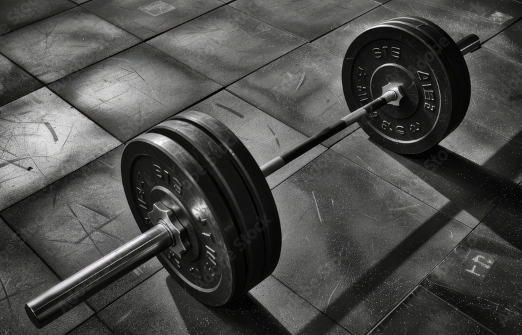
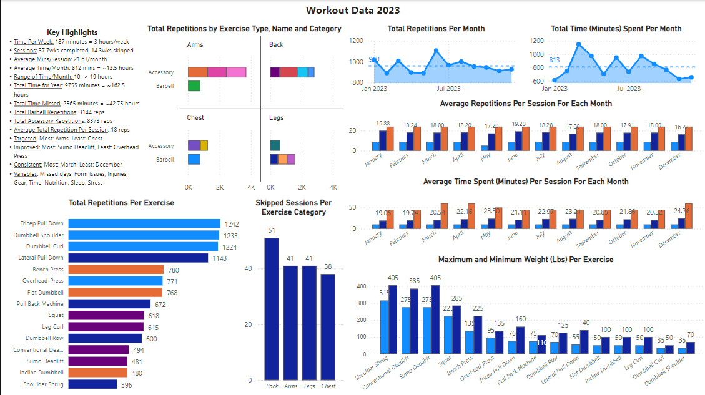

#

# Strength Training

## How To Improve Fitness Outcomes

**Author:** Kevin Leung

**Date:**  2024/01/25

**Data Analysis Contents:**

1. Ask
   
2. Prepare
   
3. Process

4. Analyze

5. Share

6. Act

#

## 1. Ask

**Background:**

Starting in 2010, I routinely tracked my workouts and created quarterly (9-week) training programs through inputting the logs into Excel worksheets. I went through a range of preset programs such as Madcow, Stronglifts, Starting Strength, RPE, etc. then decided to incorporate different set and repetition schemes (3x3, 3x5, 3x8, 5x5, etc.) that best fit my body type and powerlifting goals. This dataset compromises workout logs from the year 2023.

**Task:**

Analyzing personal raw exercise data from 2023-2024 to discover insights for a future workout plan.

#

## 2. Prepare

[Document](https://github.com/kleung157/Strength_Training_Personal_Project/blob/392570e165209392cfd02c263184ef5fcc5a1251/documents/workouts_data_preparation_processing)

(See document for details.)

#

## 3. Process

[Document](https://github.com/kleung157/Strength_Training_Personal_Project/blob/392570e165209392cfd02c263184ef5fcc5a1251/documents/workouts_data_preparation_processing)

(See document for details.)

#

## 4. Analyze

[Document](https://github.com/kleung157/Strength_Training_Personal_Project/blob/392570e165209392cfd02c263184ef5fcc5a1251/documents/workouts_data_analysis)

(See document for details.)

**Trends:**

How many minutes -> hours per week?

- 187 minutes per week = 3 hours per week

How many sessions were completed and skipped?

- Completed: 452 sessions / 12 sessions per week = 37.7 weeks

- Skipped: 171 sessions / 12 sessions per week = 14.3 weeks

Which was the most and least consistent month?
- Most: March
- Least: December
- January – 32 sessions, 610 minutes = 10 hours, 10 minutes – 19.06 mins/session
- February – 38 sessions, 750 minutes = 12 hours, 30 minutes – 19.74 mins/session
- March – 56 sessions, 1150 minutes = 19 hours, 10 minutes – 20.54 mins/session
- April – 44 sessions, 975 minutes = 16 hours, 15 minutes – 22.16 mins/session
- May – 30 sessions, 705 minutes = 11 hours, 45 minutes – 23.5 mins/session
- June – 45 sessions, 950 minutes = 15 hours, 50 minutes – 21.11 mins/session
- July – 32 sessions, 735 minutes = 12 hours, 15 minutes – 22.97 mins/session
- August – 42 sessions, 975 minutes = 16 hours 15 minutes – 23.21 mins/session
- September – 41 sessions, 855 minutes = 14 hours, 15 minutes – 20.85 mins/session
- October – 35 sessions, 765 minutes = 12 hours, 45 minutes – 21.86 mins/session
- November - 31 sessions, 630 minutes = 10 hours, 30 minutes – 20.32 mins/session
- December – 27 sessions, 655 minutes = 10 hours, 55 minutes – 24.26 mins/session
- Total: 19.06+19.74+20.54+22.16+23.5+21.11+22.97+23.21+20.85+21.86+20.32+24.26 = 259.58 / 12 = 21.63 mins/session on average
  
What is the average time spent per month? 

- 610+750+1150+975+705+950+735+975+855+765+630+655 = 9755/12 = 812 mins/60 = 13 hours 32 minutes

What is the median time spent per month?
- 610,630,655,705,735,750,765,855,950,975,975,1150 = (750+765)/2 = 757.5mins/60 = 12 hours, 37.5 minutes

What is the range of time spent per month?
- 610 -> 1150 minutes
- 10 hours to 19 hours

Total time spent for the year?
- 9755 mins = 162 hours, 35 mins 

Total time missed for the year?
- 12 weeks * 3 hours/weeks = 42.75 hours or 2565 minutes

Heaviest repetition weight for each compound lift?
- Overhead Press – 135 lbs
- Sumo Deadlift – 405 lbs
- Conventional Deadlift – 385 lbs
- Squat – 285 lbs
- Bench Press – 225 lbs

Lowest repetition weight for each compound lift?
- Overhead Press – 95 lbs
- Sumo Deadlift – 275 lbs
- Conventional Deadlift – 275 lbs
- Squat – 225 lbs
- Bench Press – 135 lbs

Most and least improved workouts?
- Most: Sumo Deadlift
- Least: Overhead Press
- Overhead Press 125 -> 135, 10 lbs
- Sumo Deadlift 295 -> 405, 110 lbs
- Conventional Deadlifts – 295 -> 385, 90 lbs
- Squat 225 -> 285, 60 lbs
- Bench Press 185 -> 225, 40 lbs

What are the total repetitions for each barbell exercise?
- Overhead Press – 771 repetitions
- Sumo Deadlift – 481 repetitions
- Conventional Deadlift – 494 repetitions
- Squat – 618 repetitions
- Bench Press – 780 repetitions
- Total: 771+481+494+618+780 = 3144 repetitions

What are the total repetitions for each accessory exercise?
- Dumbbell Row – 600 repetitions
- Lateral Pull Down – 1143 repetitions
- Shoulder Shrug – 396 repetitions
- Flat Dumbbell – 768 repetitions
- Incline Dumbbell - 480 repetitions
- Leg Curl – 615 repetitions
- Dumbbell Shoulder - 1233 repetitions
- Dumbbell Curl – 1224 repetitions
- Tricep Pull Down – 1242 repetitions
- Pull Back Machine - 672 repetitions
- Total: 600+1143+396+768+480+615+1233+1224+1242+672 = 8373 repetitions

What are the total repetitions for each month and the total average per session?
- January – 32 sessions, 636 repetitions – 19.8 reps/session
- February – 38 sessions, 693 repetitions – 18.2 reps/session
- March - 56 sessions, 1008 repetitions – 18 reps/session
- April – 44 sessions, 801 repetitions – 18.2 reps/session
- May – 30 sessions, 516 repetitions – 17.2 reps/session
- June – 45 sessions, 864 repetitions – 19.2 reps/session
- July – 32 sessions, 585 repetitions - 18.3 reps/session
- August – 42 sessions, 714 repetitions - 17 reps/session
- September- 41 sessions, 738 repetitions – 18 reps/session
- October – 35 sessions, 627 repetitions – 17.9 reps/session
- November - 31 sessions, 558 repetitions – 18 reps/session
- December – 27 sessions, 438 repetitions – 16.2 reps/session
- Total: (19.8+18.2+18+18.2+17.2+19.2+18.3+17+18+17.9+18+16.2) / (12) = 18 reps/session

What variables affected workouts?
- Missed days (vacation, pickleball, studying)
- Form issues (controlled speed, bracing, grip, stance, breathing, depth)
- Injuries (lower back, left shoulder, thumb rip)
- Gear (straps, belt, chalk, grip tape, knee sleeves, proper shoes)
- Rushing time
- Nutrition
- Sleep
- Stress

Which body category was the most and least targeted?
- Most: Arms
- Least: Chest
- Legs – 182 sessions
- Arms – 208 sessions
- Chest – 104 sessions
- Back – 130 sessions
  
#

## 5. Share

**Dashboard:**

#

## 6. Act

**Recommendations:**

Implementation of an rate of percieved exertion (RPE) scale for each session to decide whether or not to increase or decrease weight.

Be more detailed on tracking comments and personal feedback of each session to more accurately determine variables affecting workouts.

Predicting a future one repeition maximum (1RM) is not the goal because it can lead to injuries from ego lifting to chasing numbers. Use 80-90% as a 1RM and do more consistent training at a load of 50-70%. 

Incorporate different volume, set and repetition schemes such as 3x3, 5x5, 3x5, 5x3, etc. at varying RPE percentages. 

Continue to focus on the breathing and form of the exercise at hand. 
